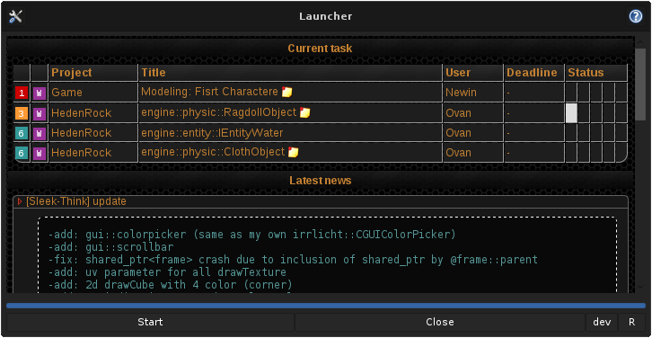

# GTKMM updater

An old project to automatically update my own game.
This project is written in C++11 with :

- GTKMM
- SQL
- WEBKIT2
- ZIP / LIBARCHIVE
- CURL

The update process is done via another thread ...
Some utilities are also coded, like resetting all game settings, launching the game/editor or the local server.
This project works on windows and linux

